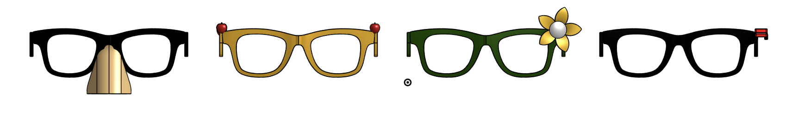
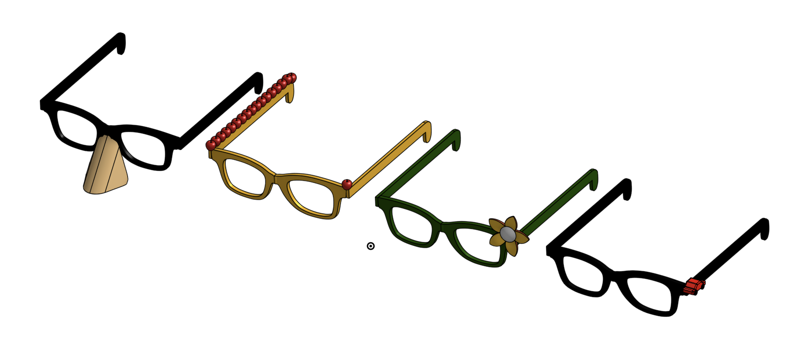
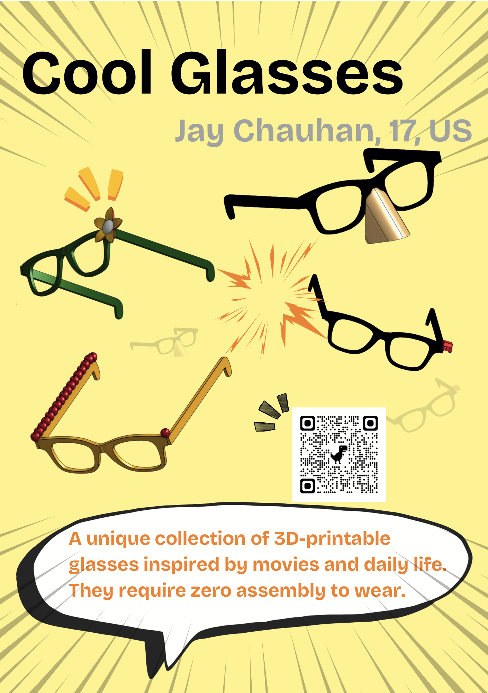

# Cool Glasses 🕶️

I've always been into sunglasses as a kid. I especially loved aviators when I watched Tom Cruise wearing them, so I decided to create four different glasses called Cool Glasses (designed to improve people's day).

---

## Project Overview

### What does it do?
This repository has files for 3D printing the glasses (like this file [cool_glasses.step](models/cool_glasses.step)). So anyone and everyone can 3D print glasses that are ready to wear out of the printing box.

### Why does it exist?
BECAUSE IT IS FUN! I really enjoy creating cool aesthetic projects that delight people. Especially projects like these which have funny elements in them and may seem pointless on first glance but actually has deeper meaning. This project was originally going to be one of AI glasses, but I realised that that was extremely ambitious for the amount of time I had, so instead I focused on just creating cool stylised glasses. 

---

## 📁 Project Structure

Here is an overview of how the files in this repository are organized:

```
cool-glasses/
├── assets/
│   └── images/               # Screenshots, renders, and preview images
├── docs/
│   ├── bom.csv               # Bill of Materials data
│   └── zine_jay_chauhan.pdf  # Full project zine / magazine publication (PDF)
├── models/
│   └── cool_glasses.step     # Complete 3D STEP CAD model for 3D printing
└── README.md                 # Project documentation
```

---

## CAD Links & Files

*   **Onshape CAD Workspace**: [Access the Onshape Document](https://cad.onshape.com/documents/00d586742cef7ce61e0fabcc/w/6bc6cadd7b22ea571d8051fb/e/4829130a5b2c78a39b27be9f?renderMode=0&uiState=6a3756a983808aa5af6e5a6a)
*   **STEP Model**: [cool_glasses.step](models/cool_glasses.step)

---

## The Unique Aspect

 there are four main pairs of glasses that together create the collection:

*  **Flower Glasses** 🌸: Inspired by my love for nature
*  **Fake Nose Glasses** 🥸: You've probably seen these in movies
*  **Apple Glasses** 🍎: I wanted to create something to do with Steve Jobs, so I created Apple Glasses haha.
*  **Car Glasses** 🚗: Literally a car on the glasses. 



---

## PICS

EYE CANDY!!!!!

### Front View


### Perspective View (Front)


### Perspective View (Back)


### Back View


---

## How to Use Them

I deliberately designed these glasses so that they wouldn't require assembly after you 3D print them. Here are the steps you need to follow to actually use them:

1. Download the model files ([cool_glasses.step](models/cool_glasses.step) or access the [Onshape Workspace](https://cad.onshape.com/documents/00d586742cef7ce61e0fabcc/w/6bc6cadd7b22ea571d8051fb/e/4829130a5b2c78a39b27be9f?renderMode=0&uiState=6a3756a983808aa5af6e5a6a)).
2. In your 3D printer, print the glasses with your type of filament.
3. WEAR YOUR AMAZING GLASSES!!!! 

---

## Bill of Materials (BOM)

| Item | Cost | Source |
| :--- | :--- | :--- |
| All items are designed by me and only require a 3D printer | $0 | Myself |
| **Total** | **$0** | **None** |

---

## Zine Page

[View Full Zine (PDF)](docs/zine_jay_chauhan.pdf)


