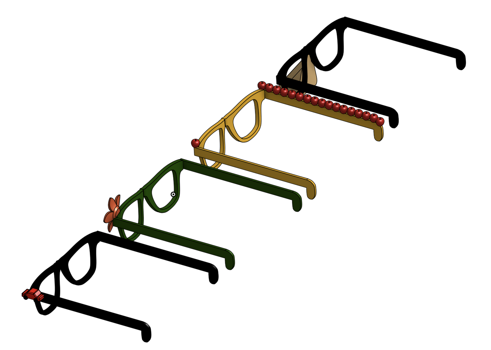
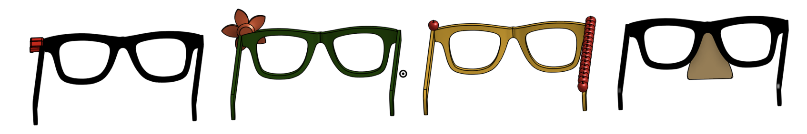

# Cool Glasses 🕶️

A collection of unique, 3D-printable glasses designed to bring fun, recognizable styles from movies and daily life into the real world.

---

## 📖 Short Description

**Cool Glasses** is a collection of 3D-printed eyewear designed to be stylish, fun, and easy to wear. Whether inspired by movies, nature, or everyday items, each pair of glasses is a unique statement piece that you can print and wear instantly.

---

## ✨ What Makes it Unique

Each pair of glasses in this collection is designed with a unique style that stands out. Currently, the project features four distinct designs:

*   🌸 **Flower Glasses**: Inspired by nature with a floral motif.
*   🥸 **Fake Nose Glasses**: A classic, humorous style resembling the famous disguise glasses.
*   🍎 **Apple Glasses**: A playful design featuring apples on the frame.
*   🚗 **Car Glasses**: A sporty, fun design featuring a car silhouette.

These are all cool-looking glasses that look great and are fun to wear in daily life!

---

## 📸 Gallery

Here are the different views of the glasses collection:

### Front View

### Perspective View (Front)

### Perspective View (Back)

### Back View

---

## 🛠️ How to Use It

Using these glasses is simple and requires **no assembly**:

1.  **Download** the 3D model files (STL/OBJ).
2.  **3D Print** the glasses using your preferred filament.
3.  **Wear them**! 

Since the items are printed as a single piece or designed for print-in-place/simple usage, you can wear them straight off the print bed.

---

## 💡 Why I Made It

I have always wanted to make cool glasses, and this project was the perfect opportunity to bring that idea to life. Originally, I wanted to start by building AI-powered smart glasses, but those were far too complex for a starting point. So, I decided to start with basic, cool-looking designs first to build the foundation!
